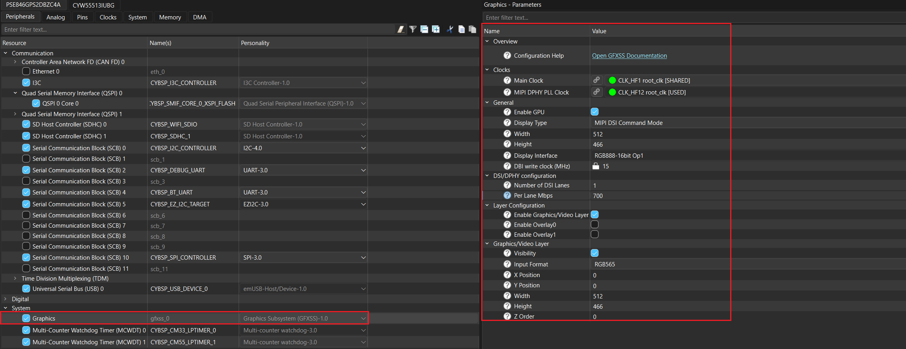

# CO5300 AMOLED DSI display driver library for ModusToolbox&trade;

## Overview

This is the driver library for [CO5300](https://admin.osptek.com/uploads/CO_5300_Datasheet_V0_00_20230328_07edb82936.pdf) display controller driving 1.43-inch 466x466 MIPI DSI AMOLED display connected to the PSOC&#8482; Edge E84 Evaluation Kit.

## Quick start

Follow these steps to add the driver in an application for PSOC&trade; Edge E84 Evaluation Kit.

1. Create a [PSOC&trade; Edge MCU: Empty application](https://github.com/Infineon/mtb-example-psoc-edge-empty-app) by following "Create a new application" section in [AN235935 – Getting started with PSOC&trade; Edge E8 on ModusToolbox&trade; software](https://www.infineon.com/AN235935) application note

2. Add the "display-amoled-co5300" library to this application using Library Manager

3. The Graphics Subsystem is configured in the Device Configurator tool as follows:

   - Enable `Graphics` resource and configure the same for 1.43-inch AMOLED (CO5300) in device-configurator as shown below for the project created in step 1.

     **Figure 1. Graphics configuration in device-configurator**

     

  - Save the modified configuration in device-configurator.

  - The driver has the MIPI DSI configuration already populated for the 1.43-inch AMOLED display as `co5300_gfx_mipi_dsi_config`. The user can use this configuration structure to overwrite the configurations generated by device-configurator tool. The following snippet must be placed in the application code.

  ```
	GFXSS_config.mipi_dsi_cfg = &co5300_gfx_mipi_dsi_config;
  ```

4. Enable GFXSS by adding it to the project's Makefile COMPONENTS list or in common.mk:
   ```
   COMPONENTS+=GFXSS
   ```
5. Use the driver by following the similar approach as shown below in the code snippet:
  
   ```cpp
   #include "cybsp.h"
   #include "mtb_display_co5300.h"

   /****************************************************************************
   * Macros
   ****************************************************************************/
   #define RESET_PORT       GPIO_PRT20
   #define RESET_PIN_NUM    7U
   #define VCI_EN_PORT      GPIO_PRT21
   #define VCI_EN_PIN_NUM   4U
   #define BRIGHTNESS_VALUE (127U)

   /****************************************************************************
   * Variable(s)
   ****************************************************************************/
   GFXSS_Type* base = (GFXSS_Type*) GFXSS;
   cy_stc_gfx_context_t gfx_context;

   /* DC IRQ Configuration. */
   cy_stc_sysint_t dc_irq_cfg =
   {
       .intrSrc      = GFXSS_DC_IRQ,
       .intrPriority = 2U
   };

   /* GPU IRQ configuration. */
   cy_stc_sysint_t gpu_irq_cfg =
   {
       .intrSrc      = GFXSS_GPU_IRQ,
       .intrPriority = 2U
   };


   /****************************************************************************
   * Function name: dc_irq_handler
   *****************************************************************************
   *
   * Display controller IRQ handler
   *
   ****************************************************************************/
   static void dc_irq_handler(void)
   {
       BaseType_t xHigherPriorityTaskWoken = pdFALSE;

       Cy_GFXSS_Clear_DC_Interrupt(GFXSS, &gfx_context);

       /* Way to synchronize frame transfer-based on DC interrupt. */
       xTaskNotifyFromISR(rtos_cm55_gfx_task_handle, 1, eSetValueWithOverwrite, 
                          &xHigherPriorityTaskWoken);

       /* Performs a context switch if a higher-priority task is woken. */
       portYIELD_FROM_ISR(xHigherPriorityTaskWoken);
   }


   /****************************************************************************
   * Function name: gpu_irq_handler
   *****************************************************************************
   *
   * GPU IRQ handler
   *
   ****************************************************************************/
   static void gpu_irq_handler(void)
   {
       Cy_GFXSS_Clear_GPU_Interrupt(GFXSS, &gfx_context);
       vg_lite_IRQHandler(); 
   }


   /****************************************************************************
   * Code
   ****************************************************************************/

   int main(void)
   {
       cy_rslt_t result;
       cy_en_gfx_status_t status = CY_GFX_SUCCESS;

       /* Initialize the device and board peripherals */
       result = cybsp_init();
       CY_ASSERT(CY_RSLT_SUCCESS == result);

       /* Enable global interrupts */
       __enable_irq();

       mtb_display_co5300_config_t co5300_config =
       {
           .gfx_config  = &GFXSS_config,
          .rst_port    = RESET_PORT,
          .rst_pin     = RESET_PIN_NUM,
          .vci_en_port = VCI_EN_PORT,
          .vci_en_pin  = VCI_EN_PIN_NUM,
       };

       /* MIPI-DSI display-specific configurations
        * If the display interface and MIPI DSI configuration for the panel
        * have been set up using Device Configurator as outlined in the steps
        * above, then this is optional.
        */
        GFXSS_config.mipi_dsi_cfg = &co5300_gfx_mipi_dsi_config;

        status = Cy_GFXSS_Init(base, &GFXSS_config, &gfx_context);

        if (CY_GFX_SUCCESS == status)
        {

            /* Initializes GFXSS DC interrupt. */
            sysint_status = Cy_SysInt_Init(&dc_irq_cfg, dc_irq_handler);

            if (CY_SYSINT_SUCCESS != sysint_status)
            {
                CY_ASSERT(0);
            }

            /* Enables GFX DC interrupt in NVIC. */
            NVIC_EnableIRQ(GFXSS_DC_IRQ);

            /* Initializes GFX GPU interrupt. */
            sysint_status = Cy_SysInt_Init(&gpu_irq_cfg, gpu_irq_handler);

            if (CY_SYSINT_SUCCESS != sysint_status)
            {
                CY_ASSERT(0);
            }

            /* Enables GPU interrupt. */
            Cy_GFXSS_Enable_GPU_Interrupt(GFXSS);

            /* Enables GFX GPU interrupt in NVIC. */
            NVIC_EnableIRQ(GFXSS_GPU_IRQ);

            /* Initialize CO5300 AMOLED driver */
            status = mtb_display_co5300_init(GFXSS_GFXSS_MIPIDSI, &co5300_config);
            CY_ASSERT(CY_GFX_SUCCESS == status);

            /* Sets Video/Graphics layer buffer address */
            Cy_GFXSS_Set_FrameBuffer(base, (uint32_t*) render_target->address,
                &gfx_context);

            /* Transfer the frame buffer to display controller */
            Cy_GFXSS_Transfer_Frame(base, &gfx_context );

            /* Set display brightness */
            mipi_status = mtb_display_co5300_set_brightness(GFXSS_GFXSS_MIPIDSI, 
                                                            BRIGHTNESS_VALUE);
            if (CY_MIPIDSI_SUCCESS != mipi_status)
            {
                CY_ASSERT(0);
            }

            /* Switch OFF display */
            mipi_status = mtb_display_co5300_off(GFXSS_GFXSS_MIPIDSI);
            if (CY_MIPIDSI_SUCCESS != mipi_status)
            {
                CY_ASSERT(0);
            }

            /* Switch ON display */
            mipi_status = mtb_display_co5300_on(GFXSS_GFXSS_MIPIDSI);
            if (CY_MIPIDSI_SUCCESS != mipi_status)
            {
                CY_ASSERT(0);
            }
        }
    
        while (true);
    }
  ```

## More information

For more information, see the following documents:

* [API reference guide](./API_reference.md)
* [ModusToolbox&trade; software environment, quick start guide, documentation, and videos](https://www.infineon.com/modustoolbox)
* [AN239191](https://www.infineon.com/AN239191) – Getting started with graphics on PSOC&trade; Edge MCU
* [Infineon Technologies AG](https://www.infineon.com)


---
© 2025, Cypress Semiconductor Corporation (an Infineon company)
